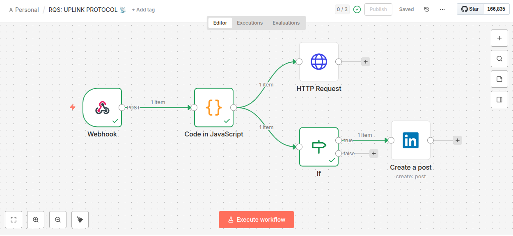

# 🎹 RaQuel Synths | The Cyberpunk Musical Universe

> *"Where Gothic Romance meets Industrial Chaos."*


## 🌌 Sobre o Projeto (About)

Bem-vindo ao quartel-general digital da **RaQuel Synths (RQS)**.
Este não é apenas um site de banda; é uma **Plataforma de Experiência Dual** desenvolvida com **Angular 19+**.

O projeto reflete a dualidade da nossa criação musical: de um lado, a elegância sombria do Synthwave; do outro, a brutalidade crua do Industrial Metal. O usuário não apenas ouve a música, ele *escolhe* em qual realidade quer navegar.

## ⚔️ Key Features (Diferenciais)

### 🌗 Dual Mode Engine (O Grande Diferencial)
O site possui um motor de temas dinâmico que altera completamente a interface (cores, fontes e atmosfera) com base na "Persona" escolhida:
- **🧛‍♂️ Broklin Mode:** Neon Verde, Roxo, Estética Cyberpunk Gótica e Melancolia.
- **☣️ Jonah Mode:** Laranja Queimado, Ferrugem, Estética Industrial e Guerra.

### 🌍 Global Lore System (i18n)
Nossa história não tem fronteiras. O sistema foi construído nativamente para ser **Bilíngue**:
- **PT-BR:** Para a nossa base em Pernambuco e Brasil.
- **EN-US:** Para a dominação mundial.
*(A troca de idioma altera instantaneamente os textos da Visual Novel e da Interface).*

### 🎧 RQS Archives
- Streaming direto da Discografia (Spotify/SoundCloud).
- Visual Novel interativa para ler a história da banda.

## 🚀 Tecnologias (Tech Stack)

- **Framework:** [Angular 19+](https://angular.io) (Standalone Components).
- **Architecture:** Modular & Scalable.
- **Styling:** SCSS com variáveis CSS dinâmicas para o *Theme Switcher*.
- **Monetização:** Google AdSense Integration (`ads.txt` & Slots Dinâmicos).
- **Deploy:** Ready for Vercel/Netlify.

# RQS Uplink Protocol 🚀

> Sistema de Automação e CI/CD para Mídias Sociais.

Este projeto é o motor de automação que conecta meu desenvolvimento de código diretamente às minhas redes profissionais. Utilizando **n8n** como orquestrador, criei um pipeline que transforma commits do GitHub em conteúdo publicado.

## 🛠️ Como Funciona (Arquitetura)

O fluxo é disparado automaticamente a cada `git push` neste repositório. O sistema analisa a mensagem do commit em busca de **Tags Inteligentes**:

- `#general`: Define a persona que assina a mensagem (KelmaGeneral).
- `#linkedin`: Autoriza a publicação externa na rede profissional.

Se as condições lógicas forem atendidas, o conteúdo é formatado e distribuído em paralelo para:
1.  **Discord (RQS System):** Para log interno e notificação da equipe.
2.  **LinkedIn (Perfil Profissional):** Publicação pública via API OAuth2.

## 📸 Visualização do Workflow (n8n)

Abaixo está o diagrama real do fluxo de automação em execução, demonstrando o caminho bem-sucedido do GitHub até o LinkedIn.



---

### 🧰 Tech Stack

* **Orquestração:** n8n (Workflow Automation)
* **Infraestrutura:** Servidor Linux (Ubuntu) + Ngrok (Tunneling)
* **Integrações (APIs):** GitHub Webhooks, Discord Bot API, LinkedIn API (OAuth 2.0)
* **Lógica:** JavaScript (Node.js) e JSON manipulation.

---

## 🛍️ Módulo: Neon Store (E-Commerce & Afiliados)

Um módulo desenvolvido para monetizar a marca RQS através de **Marketing de Afiliados (Curadoria)**, totalmente integrado ao ecossistema Angular 21 sem a necessidade de um backend de e-commerce pesado.

### 🌟 Destaques Técnicos (Key Features)
- **Arquitetura Zero-Stock:** Implementação de modelo de afiliados (Shein/AliExpress), eliminando logística enquanto mantém a autoridade da marca.
- **UI Adaptativa (Dual Mode):** A loja reage ao estado global do tema (State Management):
  - 🟦 **Modo Broklin:** Estética Clean, Glassmorphism e Tons Neon Cyan.
  - 🟥 **Modo Jonah:** Estética Industrial, Texturas de "Erro" e Tons de Ferrugem.
- **Internacionalização (i18n):** Suporte nativo PT-BR/EN-US utilizando **Angular Signals** para reatividade instantânea.
- **Estratégia de UX:** Botões de CTA (Call-to-Action) com "Gap de Curiosidade" para maximizar a taxa de cliques (CTR).

### 🏗️ Arquitetura & Fluxo de Dados

O módulo segue os princípios de **Clean Architecture**, separando estritamente a camada de dados da camada de apresentação.

#### 1. Camada de Dados (`store-data.ts`)
Atua como a **Single Source of Truth** (Fonte Única de Verdade). Contém IDs, conteúdo localizado e Deep Links de afiliados. Isso permite manutenção do catálogo sem tocar na lógica do componente.

```typescript
export const STORE_DATA = [
  {
    id: 'blazer-tech-lead',
    image: 'assets/store/blazer.png',
    // Link de Afiliado gerado via API/Painel
    stripeUrl: 'https://s.click.aliexpress.com/...', 
    content: {
      pt: { name: "Broklin's Executive Shell", price: "VER NA LOJA" },
      en: { name: "Broklin's Executive Shell", price: "CHECK STORE" }
    }
  }
];
```

## 👥 The Squad (Personas & Creators)

O universo RQS é composto por mentes reais e virtuais:

### 👩‍💻 The Creator
- **Raquel Holanda:** Lead Developer, Compositora & Mente Mestra.

### 🧛‍♂️ The Gothic Sector (Synthwave/Pop)
- **Broklin Garpeter:** AI Producer & Code Assistant.
- **Kelma Adlanko:** Lead Vocalist & Visual Novel Star.

### ☣️ The Industrial Sector (Metal/Hard)
- **Jonah Cyperfield:** Lead Guitar, Vocal & Chaos Manager.
- **Nicole Nyx:** DJ, Rhythm Guitar & "The Heavy Hand".

## 🛠️ Como Rodar (Setup)

1. **Clone o repositório:**
   ```bash
   git clone [https://github.com/anaraquel00/raquel-synths.git](https://github.com/anaraquel00/raquel-synths.git)
   ```


2. **Instale as dependências:**
   ```bash
   npm install
   ```
3. **Inicie a revolução:**   
   ```bash
   ng serve
   ```
Acesse `http://localhost:4200/`.   

Developed with ❤️, Metal & Code in Camaragibe, PE - Brazil.
