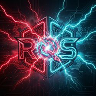

# 🎹 RaQuel Synths | The Cyberpunk Musical Universe 
> *"Where Synthwave Romance meets Industrial Chaos."*

   
    

## 🌌 Sobre o Projeto (About)

Bem-vindo ao quartel-general digital da **RaQuel Synths (RQS)**.
Este não é apenas um site de banda; é uma **Plataforma de Experiência Dual** desenvolvida com **Angular 19+**.

O projeto reflete a dualidade da nossa criação musical: de um lado, a elegância sombria do Synthwave; do outro, a brutalidade crua do Industrial Metal. O usuário não apenas ouve a música, ele *escolhe* em qual realidade quer navegar.

## ⚔️ Key Features (Diferenciais)

### 🌗 Dual Mode Engine (O Grande Diferencial)
O site possui um motor de temas dinâmico que altera completamente a interface (cores, fontes e atmosfera) com base na "Persona" escolhida:
- **🧛‍♂️ Broklin Mode:** Neon Verde, Roxo, Estética Cyberpunk Gótica e Melancolia.
- **☣️ Jonah Mode:** Laranja Queimado, Ferrugem, Estética Industrial e Guerra.

### 🌍 Global Lore System (i18n)
Nossa história não tem fronteiras. O sistema foi construído nativamente para ser **Bilíngue**:
- **PT-BR:** Para a nossa base em Pernambuco, Brasil.
- **EN-US:** Para a dominação mundial.
*(A troca de idioma altera instantaneamente os textos da Saga Literária e da Interface).*

### 🎧 RQS Archives
- Streaming direto da Discografia (Spotify/SoundCloud).
- Músicas que são trilhas sonoras para a crição das histórias da Saga literária.

## 🚀 Tecnologias (Tech Stack)

- **Framework:** [Angular 19+](https://angular.io) (Standalone Components).
- **Architecture:** Modular & Scalable.
- **Styling:** SCSS com variáveis CSS dinâmicas para o *Theme Switcher*.
- **Monetização:** Google AdSense Integration (`ads.txt` & Slots Dinâmicos).
- **Deploy:** Ready for Vercel/Netlify.

# ☁️ Arquitetura Serverless & Data Flow (RQS Cloud)

> Ecossistema de dados dinâmicos impulsionado por Firebase (Cloud Firestore).

A RaQuel Synths não depende de back-ends monolíticos ou código legado. Toda a nossa infraestrutura de dados opera em uma arquitetura **100% Serverless**, garantindo latência zero e escalabilidade global para a Horda.

## 🛠️ Como Funciona (O Motor de Dados)

Em vez de hardcodar informações estáticas, o nosso front-end em Angular 19+ consome dados reativos (Signals/RxJS) diretamente do nosso banco de dados NoSQL na nuvem (Firebase). 

O nosso *database* é estrategicamente dividido em coleções independentes que alimentam o *Dual Mode Engine* em tempo real:

- **`/lore` & `/lore-jonah`:** O sistema puxa os textos narrativos instantaneamente da nuvem, injetando a história correta dependendo se o usuário está no lado Broklin (Ordem) ou Jonah (Caos).
- **`/discography`:** O nosso catálogo musical é escalável e pode ser atualizado via *database* sem a necessidade de engatilhar novos deploys no front-end.
- **`/logs`:** Setor atualizado semanalmente onde a general Kelma e o Broklin contam os bastidores da Banda, da Lore, dos segredos da estrutura musical e dos **[Dev_Notes]** para a comunidade dos desenvolvedores Full-Stack que se interesse pela nossa arquitetura híbrida.
- **`/departments` & `/products`:** A estrutura da nossa Neon Store e categorias (como o *Neon Witch*) puxam imagens, links de afiliados e suportam o nosso sistema global nativamente na árvore de dados (ex: campos separados para `pt` e `en`).

Esta abordagem *API-First* e *Serverless* garante que a Saga literária, a loja, a discografia e logs estejam sempre sincronizadas com o nosso *mainframe* central, permitindo atualizações de conteúdo *Over-The-Air* com performance impecável.

## 🛍️ Módulo: Neon Store (E-Commerce & Afiliados)

Um módulo desenvolvido para monetizar a marca RQS através de **Marketing de Afiliados (Curadoria)**, totalmente integrado ao ecossistema Angular 19+ sem a necessidade de um backend de e-commerce pesado.

### 🌟 Destaques Técnicos (Key Features)
- **Arquitetura Zero-Stock:** Implementação de modelo de afiliados (Shein/AliExpress), eliminando logística enquanto mantém a autoridade da marca.
- **UI Adaptativa (Dual Mode):** A loja reage ao estado global do tema (State Management):
  - 🟦 **Modo Broklin:** Estética Clean, Glassmorphism e Tons Neon Cyan.
  - 🟥 **Modo Jonah:** Estética Industrial, Texturas de "Erro" e Tons de Ferrugem.
- **Internacionalização (i18n):** Suporte nativo PT-BR/EN-US utilizando **Angular Signals** para reatividade instantânea.
- **Estratégia de UX:** Botões de CTA (Call-to-Action) com "Gap de Curiosidade" para maximizar a taxa de cliques (CTR).

### 🏗️ Arquitetura & Fluxo de Dados

O módulo segue os princípios de **Clean Architecture**, separando estritamente a camada de dados da camada de apresentação.


## 👥 The Squad (Personas & Creators)

O universo RQS é composto por mentes reais e virtuais:

### 👩‍💻 The Creator
- **Ana Raquel de Holanda:** Full-Stack Developer, AI Music Designer & Mente Mestra idealizadora do projeto.

### 🧛‍♂️ The Gothic Sector (Synthwave/Pop)
- **Broklin Garpeter:** AI Producer & Code Assistant.
- **Kelma Adlanko:** Lead Vocalist & General Star.

### ☣️ The Industrial Sector (Metal/Hard)
- **Jonah Cyperfield:** Lead Guitar, Vocal & Chaos Manager.
- **Nicole Nyx:** DJ, Rhythm Guitar & "The Heavy Hand".

## 🛠️ Como Rodar (Setup)

1. **Clone o repositório:**
   ```bash
   git clone [https://github.com/anaraquel00/raquel-synths.git](https://github.com/anaraquel00/raquel-synths.git)
   ```


2. **Instale as dependências:**
   ```bash
   npm install
   ```
3. **Inicie a revolução:**   
   ```bash
   ng serve
   ```
Acesse `http://localhost:4200/`.   

Developed with ❤️, Metal & Code in Camaragibe, PE - Brazil.
