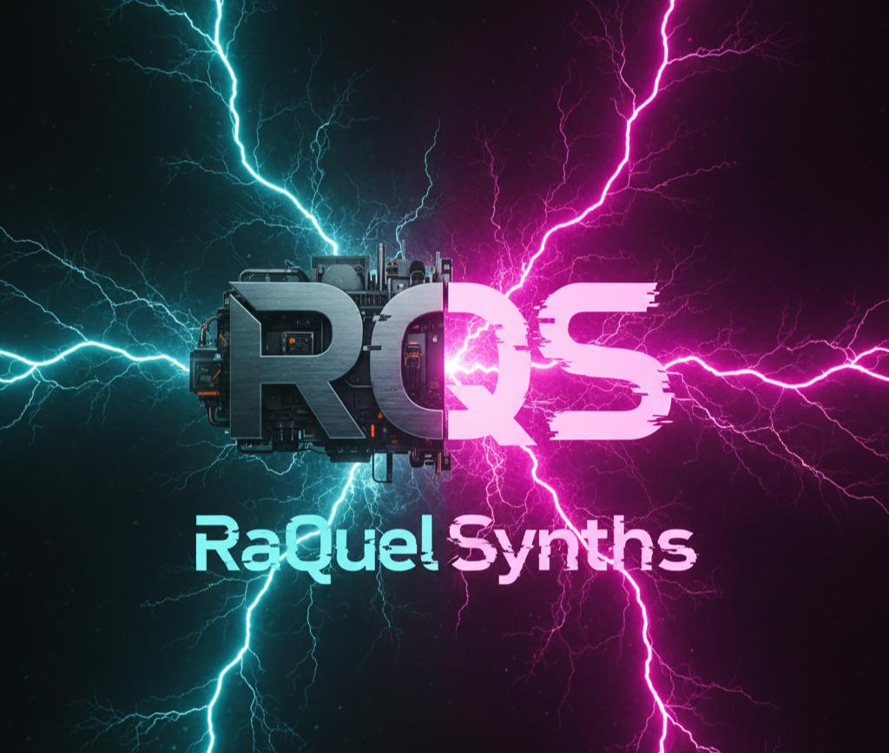

# 🎹 RaQuel Synths | The Cyberpunk Musical Universe

> *"Where Gothic Romance meets Industrial Chaos."*



## 🌌 Sobre o Projeto (About)

Bem-vindo ao quartel-general digital da **RaQuel Synths (RQS)**.
Este não é apenas um site de banda; é uma **Plataforma de Experiência Dual** desenvolvida com **Angular 19+**.

O projeto reflete a dualidade da nossa criação musical: de um lado, a elegância sombria do Synthwave; do outro, a brutalidade crua do Industrial Metal. O usuário não apenas ouve a música, ele *escolhe* em qual realidade quer navegar.

## ⚔️ Key Features (Diferenciais)

### 🌗 Dual Mode Engine (O Grande Diferencial)
O site possui um motor de temas dinâmico que altera completamente a interface (cores, fontes e atmosfera) com base na "Persona" escolhida:
- **🧛‍♂️ Broklin Mode:** Neon Verde, Roxo, Estética Cyberpunk Gótica e Melancolia.
- **☣️ Jonah Mode:** Laranja Queimado, Ferrugem, Estética Industrial e Guerra.

### 🌍 Global Lore System (i18n)
Nossa história não tem fronteiras. O sistema foi construído nativamente para ser **Bilíngue**:
- **PT-BR:** Para a nossa base em Pernambuco e Brasil.
- **EN-US:** Para a dominação mundial.
*(A troca de idioma altera instantaneamente os textos da Visual Novel e da Interface).*

### 🎧 RQS Archives
- Streaming direto da Discografia (Spotify/SoundCloud).
- Visual Novel interativa para ler a história da banda.

## 🚀 Tecnologias (Tech Stack)

- **Framework:** [Angular 19+](https://angular.io) (Standalone Components).
- **Architecture:** Modular & Scalable.
- **Styling:** SCSS com variáveis CSS dinâmicas para o *Theme Switcher*.
- **Monetização:** Google AdSense Integration (`ads.txt` & Slots Dinâmicos).
- **Deploy:** Ready for Vercel/Netlify.

## 👥 The Squad (Personas & Creators)

O universo RQS é composto por mentes reais e virtuais:

### 👩‍💻 The Creator
- **Raquel Holanda:** Lead Developer, Compositora & Mente Mestra.

### 🧛‍♂️ The Gothic Sector (Synthwave/Pop)
- **Broklin Garpeter:** AI Producer & Code Assistant.
- **Kelma Adlanko:** Lead Vocalist & Visual Novel Star.

### ☣️ The Industrial Sector (Metal/Hard)
- **Jonah Cyperfield:** Lead Guitar, Vocal & Chaos Manager.
- **Nicole Nyx:** DJ, Rhythm Guitar & "The Heavy Hand".

## 🛠️ Como Rodar (Setup)

1. **Clone o repositório:**
   ```bash
   git clone [https://github.com/anaraquel00/raquel-synths.git](https://github.com/anaraquel00/raquel-synths.git)
   ```


2. **Instale as dependências:**
   ```bash
   npm install
   ```
3. **Inicie a revolução:**   
   ```bash
   ng serve
   ```
Acesse `http://localhost:4200/`.   

Developed with ❤️, Metal & Code in Camaragibe, PE - Brazil.
